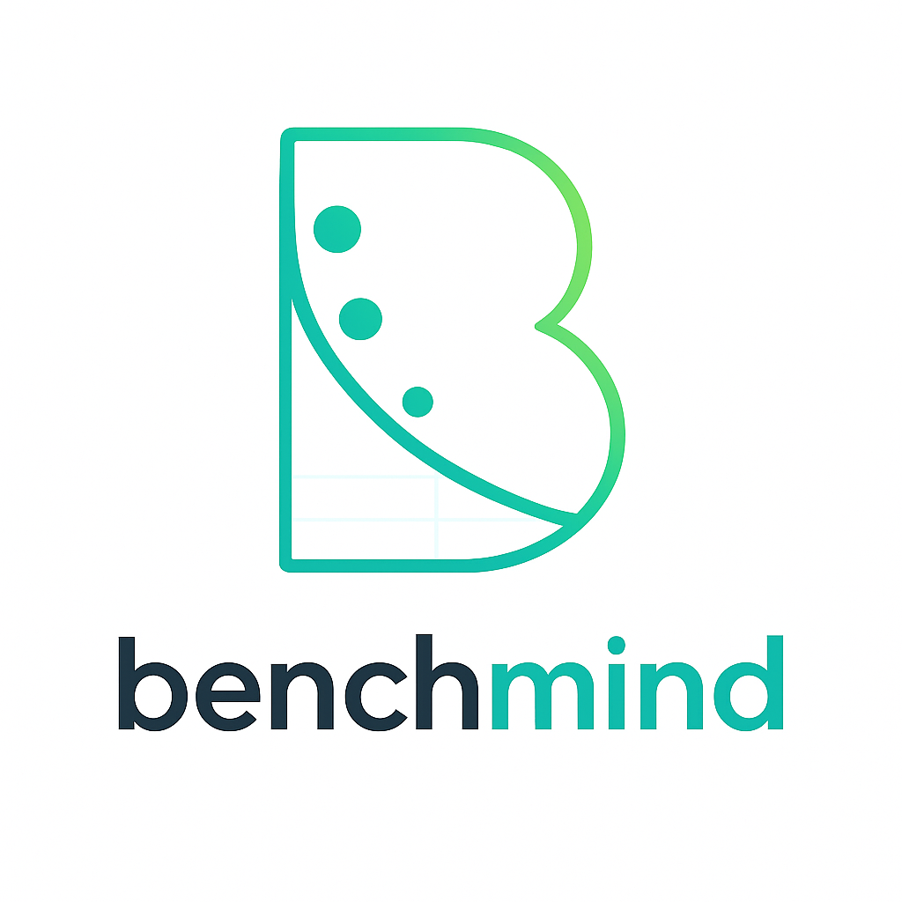

<div align="center">
  
  
  # 🎯 Benchmind
  **AI Model Selection with Environmental Intelligence**
</div>

> Choose the right AI model for your task based on **performance, cost, and carbon footprint** — powered by Google ADK and real-world benchmarking.

## What It Does

Benchmind is an AI consultant that helps you select optimal models by:
- 🤖 **Understanding your task** through natural language
- 🔍 **Searching the web** for model quality benchmarks (MMLU, HumanEval)
- ⚡ **Benchmarking efficiency** with real API calls (latency, cost, CO₂)
- 📊 **Visualizing trade-offs** with interactive charts (scatter plots, radar charts, bar charts)
- 🌱 **Color-coded insights** - Green (most eco-friendly) to Red (least eco-friendly)
- 💡 **Recommending** the best model with detailed reasoning

**Key Innovation:** Combines efficiency metrics (measured via EcoLogits) with quality data (web-sourced) for complete model evaluation.

## 🏗️ Tech Stack

**Backend:** FastAPI + Google ADK (Agent Development Kit) + EcoLogits (ISO 14044)  
**Frontend:** React + TypeScript + Recharts  
**AI:** Google Gemini (reasoning) + DuckDuckGo (web search) + Mistral API (benchmarking)

## 🚀 Quick Start

### Prerequisites
- **Python 3.8+** with pip
- **Node.js 18+** with npm
- **API Keys**: Mistral AI, **2x Google Gemini keys** (see [API_KEY_SETUP.md](API_KEY_SETUP.md))

### 1. Backend Setup

```bash
# Navigate to backend
cd backend

# Create virtual environment
python -m venv venv
source venv/bin/activate  # Windows: venv\Scripts\activate

# Install dependencies
pip install -r requirements.txt

# Configure environment
cp .env.example .env
# Edit .env with your API keys:
# MISTRAL_API_KEY=your_mistral_key
# GEMINI_API_KEY=your_first_gemini_key   # Main agent
# GOOGLE_API_KEY=your_second_gemini_key  # Search agent

# Get your API keys from:
# Mistral API: https://console.mistral.ai/
# Google Gemini API: https://aistudio.google.com/app/apikey (create 2 keys)
# See API_KEY_SETUP.md for detailed instructions

# Start the server (choose one)
python -m app.main                    # Direct Python execution
# OR
uvicorn app.main:app --reload         # Using uvicorn with auto-reload
```

Backend available at: `http://localhost:8000`

**API Documentation:** `http://localhost:8000/docs` (FastAPI auto-generated)

### 2. Frontend Setup

```bash
# Navigate to frontend
cd frontend

# Install dependencies
npm install

# Start development server
npm run dev
```

Frontend available at: `http://localhost:3000`

## 🎮 Usage

1. **Describe your task**: *"I need an AI-powered Q&A system for my knowledge base"*
2. **Select 1-3 models** to compare from the dropdown menu
3. **Click "🌱 See greenest models"** and wait 1-2 minutes for benchmarking
4. **Get intelligent recommendations** with:
   - **Efficiency metrics**: Latency, cost, CO₂ (measured via real API calls + EcoLogits)
   - **Quality insights**: MMLU/HumanEval scores (sourced from web search)
   - **Trade-off analysis**: Speed vs cost vs environmental impact
   - **Interactive charts**: 
     - 💰 Cost vs CO₂ scatter plot (color-coded by greenness)
     - 🕸️ Multi-dimensional radar chart
     - 📊 Bar charts for latency, cost, and environmental impact
     - 🌱 EcoLogits environmental insights with real-world equivalents

## 📊 Example Output

**Section 1: Efficiency Analysis** (from benchmarking)
```
| Model              | Latency | Cost    | Energy  | CO₂    |
|--------------------|---------|---------|---------|--------|
| Mistral Tiny 2407  | 2080ms  | $0.00035| 0.28 Wh | 0.17g  |
| Mistral Tiny Latest| 1432ms  | $0.00035| 0.25 Wh | 0.15g  |
| Devstral Small     | 1228ms  | $0.00035| 0.50 Wh | 0.30g  |
```

**Section 2: Quality Research** (from web search)
```
🔍 Mistral Tiny Latest:
• Versatile model for generative AI tasks
• Source: https://mistral.ai/news - ✅ Highly Credible
• No specific MMLU scores found for this version

🔍 Devstral Small:
• Specialized for software engineering tasks
• Source: https://mistral.ai/news/devstral - ✅ Highly Credible
```

**Section 3: Final Recommendation**
```
Winner: Mistral Tiny Latest
- Fastest latency (1432ms)
- Lowest CO₂ (0.15g)
- General-purpose model (vs Devstral's code specialization)
```

## 🌟 Features

- ✅ **Real-time benchmarking** with actual API calls to Mistral models
- ✅ **EcoLogits integration** for accurate CO₂ and energy measurements (ISO 14044)
- ✅ **Google ADK ReAct agent** for intelligent reasoning and tool use
- ✅ **Independent web search** for quality benchmarks (no rate limit conflicts)
- ✅ **Dynamic color-coding** - Models ranked by greenness (CO₂ + cost)
- ✅ **Interactive tooltips** showing exact metrics for each model
- ✅ **Professional UI** with shadcn/ui components and Tailwind CSS

## 📁 Project Structure

```
Benchmind/
├── backend/
│   ├── app/
│   │   ├── agents/
│   │   │   ├── adk_green_agent.py      # Main ReAct agent (Google ADK)
│   │   │   └── adk_search_agent.py     # Web search sub-agent (DuckDuckGo)
│   │   ├── tools/
│   │   │   ├── tools.py                # Benchmarking & cost analysis tools
│   │   │   └── duckduckgo_search.py    # Web search implementation
│   │   ├── routers/
│   │   │   ├── consultant.py           # AI consultant endpoint
│   │   │   ├── models.py               # Model registry endpoint
│   │   │   └── test_ecologits.py       # EcoLogits testing endpoint
│   │   ├── services/
│   │   │   ├── energy_estimator.py     # Energy/CO₂ calculations
│   │   │   ├── model_registry.py       # Available models database
│   │   │   └── simulator.py            # Task simulation logic
│   │   ├── schemas/
│   │   │   ├── requests.py             # Pydantic request models
│   │   │   └── responses.py            # Pydantic response models
│   │   ├── core/
│   │   │   ├── config.py               # Settings & environment vars
│   │   │   ├── logging.py              # Logging configuration
│   │   │   └── exceptions.py           # Custom exceptions
│   │   ├── utils/
│   │   │   └── utils.py                # Helper functions
│   │   └── main.py                     # FastAPI app entry point
│   ├── requirements.txt
│   └── .env.example
├── frontend/
│   ├── src/
│   │   ├── components/
│   │   │   ├── AIConsultant.tsx        # Main consultant interface
│   │   │   ├── BenchmarkCharts.tsx     # Interactive charts (Recharts)
│   │   │   ├── ProfessionalLayout.tsx  # App layout & navigation
│   │   │   └── CleanBenchmindRunner.tsx # Alternative UI
│   │   ├── api/
│   │   │   └── benchmind.ts            # API client (Axios)
│   │   ├── styles/
│   │   │   └── index.css               # Tailwind CSS
│   │   ├── App.tsx                     # Root component
│   │   └── main.tsx                    # React entry point
│   ├── package.json
│   ├── vite.config.ts
│   └── .env.example
├── README.md
└── API_KEY_SETUP.md
```

## 🤝 Contributing

Contributions welcome! Open an issue or PR.
