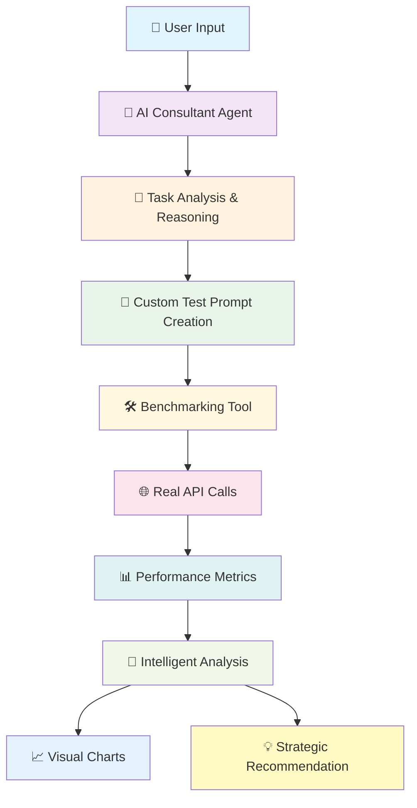

<div align="center">
  
  
  # 🎯 Benchmind
  **AI Model Selection Engine with Green-AI Observability**
</div>

Transform your AI model selection process with intelligent, data-driven recommendations that consider quality, performance, cost, and environmental impact.

## 🎯 Overview

Benchmind is a comprehensive AI model evaluation platform that helps developers, data scientists, and engineering teams make informed decisions about which AI models to use for their specific applications. Our intelligent consultant analyzes your requirements and provides strategic recommendations based on real benchmarking data.

### Core Value Proposition

Evaluate and select AI models across **4 key dimensions**:

1. **🎯 Quality/Accuracy** - Performance on your specific tasks
2. **⚡ Latency/Speed** - Response time and real-time performance  
3. **💰 Cost Efficiency** - Token pricing and operational expenses
4. **🌱 Environmental Impact** - Energy consumption and carbon footprint

## ✨ Key Features

- **🤖 AI Consultant** - Intelligent ReAct agent that understands your use case and creates custom benchmarks
- **📊 Real-time Benchmarking** - Live performance testing with actual API calls to AI models
- **🌍 Green AI Dashboard** - Visualize performance vs energy vs CO₂ trade-offs
- **📈 Interactive Charts** - Multi-dimensional analysis with beautiful data visualizations
- **💡 Strategic Recommendations** - Data-driven insights with detailed reasoning
- **🏢 Enterprise Ready** - Production-grade architecture with proper logging and error handling

## 🏗️ Architecture

### Modern FastAPI Backend
```
backend/
├── app/                          # 🎯 Main application package
│   ├── main.py                  # 🚀 App factory with lifespan management
│   ├── core/                    # ⚙️ Core system configuration
│   │   ├── config.py           # 🔧 Pydantic settings with environment variables
│   │   ├── logging.py          # 📝 Structured logging setup
│   │   └── exceptions.py       # 🛡️ Custom exceptions & error handlers
│   ├── routers/                 # 🌐 API endpoints (thin layer)
│   │   ├── models.py           # 📊 GET /models - 60+ AI models registry
│   │   └── consultant.py       # 🤖 POST /ai-consultant - Intelligent recommendations
│   ├── schemas/                 # 📋 Pydantic request/response models
│   │   ├── requests.py         # ✅ Input validation schemas
│   │   └── responses.py        # 📤 Output response schemas
│   ├── services/                # 💼 Business logic (clean separation)
│   │   ├── model_registry.py   # 🗂️ Mistral API integration & model metadata
│   │   ├── consultant_agent.py # 🧠 ReAct agent service with error handling
│   │   └── simulator.py        # 🎮 Task simulation logic
│   ├── agents/                  # 🤖 AI agents & tools
│   │   ├── agent.py            # 🔗 LangChain ReAct agent with Gemini
│   │   └── tools.py            # 🛠️ Real benchmarking tools with API calls
│   └── utils/                   # 🔧 Utility functions
│       └── utils.py            # 💰 Cost calculation, 🌱 environmental impact
├── .env.example                 # 📝 Environment variables template
└── requirements.txt             # 📦 Python dependencies
```

### React Frontend
```
frontend/
├── src/
│   ├── components/             # React components
│   │   ├── AIConsultant.tsx   # Main consultant interface
│   │   └── BenchmarkCharts.tsx # Data visualization
│   ├── api/                   # API client
│   └── pages/                 # Next.js pages
├── package.json               # Node.js dependencies
└── next.config.js            # Next.js configuration
```

## 🚀 Quick Start

### Prerequisites
- **Python 3.8+** with pip
- **Node.js 18+** with npm
- **API Keys**: Mistral AI, Google Gemini

### 1. Backend Setup

```bash
# Navigate to backend
cd backend

# Create virtual environment
python -m venv venv
source venv/bin/activate  # Windows: venv\Scripts\activate

# Install dependencies
pip install -r requirements.txt

# Configure environment
cp .env.example .env
# Edit .env with your API keys:
# MISTRAL_API_KEY=your_mistral_key
# GEMINI_API_KEY=your_gemini_key

# Start the server (choose one)
python -m app.main                    # Direct Python execution
# OR
uvicorn app.main:app --reload         # Using uvicorn with auto-reload
```

Backend available at: `http://localhost:8000`

**API Documentation:** `http://localhost:8000/docs` (FastAPI auto-generated)

### 2. Frontend Setup

```bash
# Navigate to frontend
cd frontend

# Install dependencies
npm install

# Start development server
npm run dev
```

Frontend available at: `http://localhost:3000`

## 🎮 How to Use

1. **📝 Describe Your Task**
   - "I'm creating a document summarization tool for legal contracts"
   - "I want to build a customer support chatbot for my SaaS product"
   - "I need an AI-powered search and Q&A system for my knowledge base"

2. **🎯 Select Models to Compare** (Optional)
   - Choose from 60+ available models: `mistral-tiny`, `mistral-small`, `open-mistral-nemo`, etc.
   - Leave empty to let the agent choose optimal models for your task

3. **🤖 Get AI Recommendations**
   - ReAct agent analyzes your requirements and creates custom test prompts
   - **Real benchmarking** with actual Mistral API calls
   - **Intelligent analysis** of quality, speed, cost, and environmental impact

4. **📊 Review Results**
   - **Multi-dimensional charts**: Radar plots, bar charts, performance tables
   - **Strategic recommendations**: "For legal documents, Open Mistral Nemo offers 90% quality..."
   - **Trade-off analysis**: Cost vs quality vs environmental impact
   - **Reasoning transparency**: See exactly how the agent made its decisions

## 🔄 Intelligent Workflow



### 🎯 **Step-by-Step Breakdown:**

#### 1. **👤 User Input**
```
"I'm creating a document summarization tool for legal contracts"
+ Selected models: ["mistral-small", "mistral-tiny", "open-mistral-nemo"]
```

#### 2. **🤖 AI Consultant Agent (Gemini-Powered ReAct)**
- **Reasoning**: *"Legal documents require high accuracy. I need to test summarization capabilities with a complex legal clause..."*
- **Action Planning**: *"I'll create an NDA clause test and benchmark the selected models"*

#### 3. **💭 Task Analysis & Custom Prompt Creation**
```
Generated Test Prompt:
"Summarize the following clause from a Non-Disclosure Agreement: 
'Recipient acknowledges that the Confidential Information is proprietary...'"
```

#### 4. **🛠️ Real Benchmarking Tool Execution**
```python
# For each model:
- mistral-small  → API Call → Response + Metrics
- mistral-tiny   → API Call → Response + Metrics  
- open-mistral-nemo → API Call → Response + Metrics
```

#### 5. **📊 Performance Metrics Collection**
```json
{
  "model": "Open Mistral Nemo",
  "quality": 0.9,           // ✅ Accuracy assessment
  "latency_ms": 742.58,     // ⚡ Speed measurement
  "cost_usd": 0.000416,     // 💰 Real cost calculation
  "energy_wh": 0.312,       // 🌱 Environmental impact
  "co2_g": 0.0936,          // 🌍 Carbon footprint
  "tokens_used": 208        // 📝 Token efficiency
}
```

#### 6. **🧠 Intelligent Analysis & Recommendation**
```
Agent Reasoning:
"For legal contract summarization, quality and accuracy are paramount. 
Open Mistral Nemo stands out with 90% quality, fastest response time (743ms), 
and superior accuracy for legal documents. While it costs more ($0.000416 vs $0.0000615), 
the enhanced accuracy justifies the cost for legal use cases..."
```

#### 7. **📈 Visual Dashboard**
- **🕸️ Multi-dimensional radar chart** - Performance overview
- **📊 Quality comparison bars** - Model accuracy ranking  
- **⚡ Latency comparison** - Speed analysis
- **💰 Cost efficiency** - Budget optimization
- **🌱 Environmental impact** - Green AI metrics
- **📋 Performance summary table** - Complete data overview

## 🔧 API Endpoints

### Core Endpoints
- `GET /` - API information and health
- `GET /models` - Available AI models registry
- `POST /ai-consultant` - Intelligent model recommendations
- `GET /health` - System health check

### Example Request
```json
{
  "task_description": "I'm creating a document summarization tool for legal contracts",
  "user_context": "Need high accuracy for legal documents, cost is secondary",
  "selected_models": ["mistral-small", "mistral-tiny", "open-mistral-nemo"]
}
```

### Example Response
```json
{
  "success": true,
  "task": "I'm creating a document summarization tool for legal contracts",
  "recommendation": "For your legal contract summarization tool, **Open Mistral Nemo** is the optimal choice with 90% quality, 743ms latency, and superior accuracy for legal documents...",
  "benchmark_results": [
    {
      "model": "Open Mistral Nemo",
      "quality": 0.9,
      "latency_ms": 742.58,
      "cost_usd": 0.000416,
      "energy_wh": 0.312,
      "co2_g": 0.0936,
      "tokens_used": 208
    }
  ],
  "reasoning_steps": [...],
  "timestamp": "2024-10-28T15:42:56Z",
  "consultant_version": "1.0"
}
```

## 🧠 AI Consultant Intelligence

Our ReAct agent powered by Google Gemini:

1. **🔍 Analyzes** your task description and requirements
2. **💭 Reasons** about the best approach for testing
3. **🛠️ Creates** custom test prompts that simulate real usage
4. **⚡ Executes** benchmarks with actual API calls
5. **📈 Measures** quality, latency, cost, and environmental impact
6. **🎯 Recommends** optimal models with detailed explanations

## 🌱 Green AI Focus

Benchmind emphasizes environmental responsibility:

- **📊 CO₂ Emissions** - Calculate carbon footprint per model
- **⚡ Energy Consumption** - Track power usage in Wh
- **🌍 Environmental Impact** - Compare green alternatives
- **📈 Sustainability Metrics** - Make eco-conscious decisions

## 🏢 Production Ready

- **⚙️ Structured Configuration** - Pydantic settings with environment variables
- **📝 Comprehensive Logging** - Structured logging for observability
- **🛡️ Error Handling** - Custom exceptions with proper HTTP responses
- **🔒 Security** - API key management and validation
- **📦 Dependency Injection** - Clean FastAPI patterns
- **🧪 Testable Architecture** - Separated business logic

## 🛠️ Tech Stack

### Backend
- **FastAPI** - Modern, fast web framework
- **LangChain** - AI agent framework
- **Pydantic** - Data validation and settings
- **Google Gemini** - Reasoning brain for AI consultant
- **Mistral AI** - Model provider for benchmarking

### Frontend  
- **Next.js** - React framework for production
- **TypeScript** - Type-safe JavaScript
- **Tailwind CSS** - Utility-first styling
- **Recharts** - Data visualization library

## 📈 Development Roadmap

- [x] **Core Platform** - AI consultant with real benchmarking
- [x] **Green AI Metrics** - Environmental impact calculation
- [x] **Production Architecture** - Professional FastAPI structure
- [ ] **Database Integration** - Persistent storage for results
- [ ] **Advanced Visualizations** - Pareto frontier analysis
- [ ] **Multi-provider Support** - OpenAI, Anthropic integration
- [ ] **Team Features** - Collaboration and sharing
- [ ] **API Rate Limiting** - Production-grade controls

## 🤝 Contributing

We welcome contributions! Please see our [Contributing Guide](CONTRIBUTING.md) for details.

1. Fork the repository
2. Create a feature branch (`git checkout -b feature/amazing-feature`)
3. Commit your changes (`git commit -m 'Add amazing feature'`)
4. Push to the branch (`git push origin feature/amazing-feature`)
5. Open a Pull Request

MIT License - See LICENSE file for details


